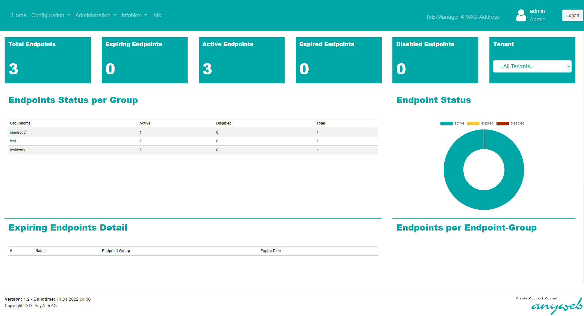

# 🛡️ISE Management Tool

[](https://developer.cisco.com/codeexchange/github/repo/Anyweb/ISE-Management-Tool)

A python-based tool to manage a Cisco ISE over a command-line interface. It can be used to perform CRUD actions on Endpoints/Identity Groups or for setting up specific testing environments for Anyweb's [ISE-Manager](https://www.anyweb.ch/anyweb-produkte/anyweb-ise-manager/).  

#### ISE-Manager
Anyweb's ISE-Manager extends this Tools functionality even more by providing a fully-fledged web-solution for administrating a Cisco ISE, as well as allowing the integration of a variety of business relevant process workflows and systems. The swiss army knife for your Cisco ISE - in true Anyweb fashion! 



## 📦Dependencies
This application relies on Pipenv for package and environment management. If not already installed, please make sure to do so using [the official docs](https://pipenv-fork.readthedocs.io/en/latest/install.html#installing-pipenv).

If no environment should be used, you could still opt out for the direct-route of manually installing the packages `pip install -r requirements.txt`. This will clutter your current system, so keep that in mind!

## 🗺️Quick Start Guide
_The following guide is tested on Ubuntu 22.04 using Python 3.8._

1. Clone the repository to a local directory
2. In the same directory as `main.py` (root directory) add a `.env`-file containing the following information:
```bash
username="myCiscoISEUser"
password="mySecret"
baseurl="https://[HOST]:9060/ers/config"
```
3. Install the dependencies using `pipenv install`
4. Run the application `pipenv run python main.py --help`


## ℹ️Usage
To activate this project's virtualenv, run `pipenv shell`.
Alternatively, run a command inside the virtualenv with `pipenv run`.

**Basic usage:** `pipenv run python main.py [ARGS]`

```bash
  usage: main.py [-h] [--name NAME] [--mac MAC] [--description DESCRIPTION]
               [--filter-operator {EQUALS,NOT_EQUALS,STARTS_WITH,NOT_STARTS_WITH,ENDS_WITH,NOT_ENDS_WITH,CONTAINS,NOT_CONTAINS}] [--lookup] [--create]
               [--delete] [--delete-with-clear] [--dry-run] [--create-isemanager-init]

🤠 ISE-Manager Light used to create, delete, search Endpoints and Endpoint Groups. And a lot more!

optional arguments:
  -h, --help                    show this help message and exit

  --name NAME                   Specify a name for Endpoints/Group.
  --mac MAC                     Specify a MAC-Address for Endpoint.
  --description DESCRIPTION     Specify a Description for Endpoint/Group.

  --filter-operator             {EQUALS,NOT_EQUALS,STARTS_WITH,NOT_STARTS_WITH,ENDS_WITH,NOT_ENDS_WITH,CONTAINS,NOT_CONTAINS}
                                Possible choices are: [EQUALS, NOT_EQUALS, STARTS_WITH, NOT_STARTS_WITH, ENDS_WITH, NOT_ENDS_WITH, CONTAINS, NOT_CONTAINS] Has to be
                                used in conjunction with '--name' (for EndpointGroups) or '--mac' (for Endpoints). Defaults to EQUALS.

  --lookup                      🔍 [SEARCH] Find an Endpoint Group with it's Endpoints (using '--name') or an Endpoint (using '--mac'). Can be used in conjunction with '
                                --filter-operator'
  --create                      ✏️ [CREATE] Create an Endpoint Group (using '--name' and '--description') or an Endpoint (using '--mac' and '--description').
  --delete                      🗑️ [DELETE] Delete an Endpoint Group (using '--name') or an Endpoint (using '--mac').
  --delete-with-clear           🗑️ [DELETE] Delete an Endpoint Group (using '--name') and all of it's Endpoints. Can be used in conjunction with '--filter-operator'.
  --dry-run                     🏍️ Show what Endpoints and Groups are involved witout performing the action
  --create-isemanager-init      📄 Creates a SQL file and a CSV file per group with all the associated endpoints. Designed to help syncing for ISE to ISEManager.   
  ```

## 💡Examples

Some samples would be:   
 - Print all Endpoint Groups: `main.py --lookup --name "" --filter-operator CONTAINS`
 - Print Endpoints containing a certain MAC-Block: `main.py --lookup --mac "00:01" --filter-operator CONTAINS`
 - Simulate (_DRY-RUN_) removal of Identity Groups containing "testgb" with all their Endpoints:   
 ```bash
 /main.py --delete-with-clear --name "testgb" --filter-operator CONTAINS --dry-run
----DRY-RUN----
----------------------------------------------
 o GID: af42ae80-e5bb-11eb-894b-005056b226aa
 o Name: TestGBenAbou123
 o Description: description
  -> Endpoint: 00:01:02:03:04:06
----------------------------------------------
 o GID: 75f5ea70-e57f-11eb-894b-005056b226aa
 o Name: TestGB123
 o Description: Test Endpoint Group 1
 ```

## ⚠️Known issues

The application does not currently implement any kind of threading, which would be mandatory for larger datasets.  

## 📯 Getting help

Please use the [issue-page](https://gitlab.com/anyweb/cisco-code-exchange/ise-management-tool/-/issues) of the repository for any requests or bug reports.

## ✏️ Author(s)

This project was written and is maintained by the following individuals:

- ISE-Manager Team @ Anyweb AG 
